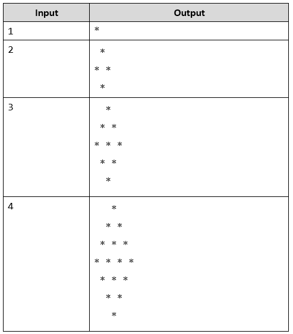

<h1 align="center">Lab: First Steps in OOP</h1>
Problems for exercise and homework for the [Python OOP Course @SoftUni](https://softuni.bg/courses/python-oop).

Submit your solutions in the SoftUni judge system at [https://judge.softuni.bg/Contests/1934](https://judge.softuni.bg/Contests/1934).

## 1.Rhombus of Stars

Create a program that reads a **positive**** integer **** N **as input and prints on the console a** rhombus **with size** n**:

**Examples**

## 2.Scope Mess

Fix the code below, so it returns the expected output. Submit the fixed code in the judge system.

x = **&quot;global&quot;**

**def** outer():
 x = **&quot;local&quot;**

**def** inner():
 x = **&quot;nonlocal&quot;**
print( **&quot;inner:&quot;** , x)

**def** change\_global():
x = **&quot;global: changed!&quot;**

print( **&quot;outer:&quot;** , x)
 inner()
print( **&quot;outer:&quot;** , x)
 change\_global()

print(x)
 outer()
print(x)

### Examples

| **Current Output** | **Expected Output** |
| --- | --- |
| globalouter: localinner: nonlocalouter: localglobal | globalouter: localinner: nonlocalouter: nonlocalglobal: changed! |

## 3.Class Book

Create a class called **Book**. It should have an **\_\_init\_\_()** method that should receive:

- **name: string**
- **author: string**
- **pages** : **int**

Submit only the class in the judge system.

### Examples

| **Test Code** | **Output** |
| --- | --- |
| book = Book(&quot;My Book&quot;, &quot;Me&quot;, 200)print(book.name)print(book.author)print(book.pages) | My BookMe200 |

## 4.Car

Create a class called **Car**. Upon initialization it should receive a **name** , **model** and **engine** (all strings). Create a method called **get\_info()** which will return a string in the following format:
**&quot;**** This is {name} {model} with engine {engine} ****&quot;**.

### Examples

| **Test Code** | **Output** |
| --- | --- |
| car = Car(&quot;Kia&quot;, &quot;Rio&quot;, &quot;1.3L B3 I4&quot;)print(car.get\_info()) | This is Kia Rio with engine 1.3L B3 I4 |

## 5.Music

Create class named **Music** that receives **title**** (string) **,** artist****(string)**and **lyrics**** (string) **upon initialization. The class should also have methods** print****\_info()** and **play()**:

- The **print**** \_info() **method should return the following:**&#39;This is &quot;{title}&quot; from &quot;{artist}&quot;&#39;**
- The **play()** method should **return** the **lyrics**.

Submit **only the class** in the judge system. **Test your code** with your own examples.

### Examples

| **Test Code** | **Output** |
| --- | --- |
| song = Music(&quot;Title&quot;, &quot;Artist&quot;, &quot;Lyrics&quot;)print(song.print\_info())print(song.play()) | This is &quot;Title&quot; from &quot;Artist&quot;Lyrics |
